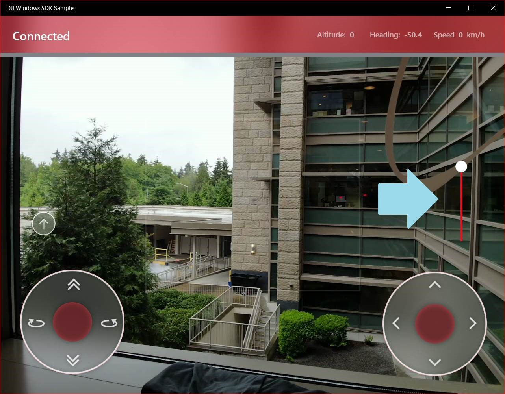
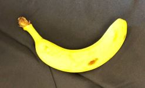
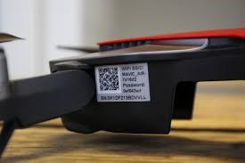

# Drone with ML

## Prerequisites
- A Windows 10 PC running 1803 build 17134
- Ensure fully charged **DJI Mavic Air** drone (4 dots of battery)
- Xbox Controller (if Microsoft employee flying, alternatives available if not) **special app build required**

## Setup

1. Sideload and install the demo ap
	* Unzip **002 - DJIUWPDemo_1.2.5.0_Test_NDA_Do_Not_Share.zip** to c:\demos\dji
	* Install via Add-AppDevPackage.ps1
	>**This demo app is shared under NDA - please do not share publicly.**

	**Troubleshooting:** If you receive an error while trying to deploy the app, try removing the Dependencies directory, and retrying the Powershell script.

2. Pin app (**DJI Windows SDK Sample**) to the start menu

3. Pair drone to PC
 	- Turn on drone battery by pressing once, and then holding button until you hear TWO beeps. 
	- The drone will become a wifi hotspot. Find it from windows and connect to that wifi hotspot. The password is on the side of the drone
	- Test audio going out from PC (so app can say banana)
	- UI controls only appear when the app is connected to the drone's WiFi

4. In the app, the slider on the right is for controlling the drone’s camera gimbal on the vertical axis. Use it for pointing the camera down, so you can just carry the drone straight: 

5. The app uses a simple classification WinML model, so:
	- Make sure you using a more or less solid background for putting a banana. Don’t use a too bright one. If you have bright lightning on the banana, too dark background is also not good. 
	- There is a “central zone” rectangle on the camera feed in the app – try to keep banana within that area and just a bit less of its bounding.
	- Keep the banana horizontally, like this: 
	- If you feel that the app doesn’t recognize the banana for too long (>5 sec), press “B” (either on the keyboard or Xbox One controller) – this is our plan “B”
	- Practice the demo, including plan “B”  

## Troubleshooting

* If you cannot see the drone’s WiFi, make sure it is in the WiFi mode (hold rear button until you hear 2 beeps)
* WiFi network’s SSD and password are in the battery compartment and on a side of the drone 
* Sometimes the app suddenly disconnects from the drone. Don’t freak out, it will reconnect very soon

## IMPORTANT
You should **NOT fly** the drone live as: 

a) It is dangerous for real  
b) Microsoft offices don’t allow it

Instead, just move the drone with the hands, pretending to fly it 

> In special circumstances a **Microsoft employee** with pre-approval may fly the drone - in that case, please read the following additional considerations:
>* Connect Xbox One controller with a USB cable **prior** to connecting to drone’s WiFi 
>* If a controller is detected, on-screen joysticks are hidden
>* The app version in Teams has flight control capabilities disabled - see **000 - Prerequisites** for details on obtaining alternative version

## Demo Script 
1. Start app on pc

2. Pair wifi if it disconnected (see setup)

3. Move camera gamble from the app

4. Taking the drone in your hands, get close to banana

## Demo Reset 
1. Disconnect drone from hotspot
2. Turn off the drone (same sequence as for when you turned it on - see **Setup**)